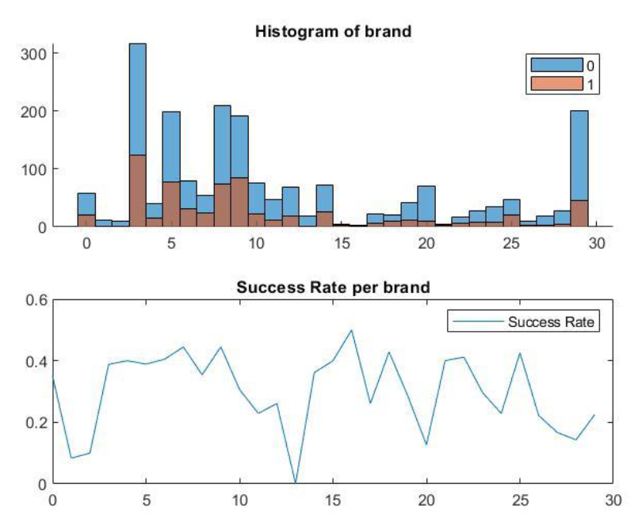
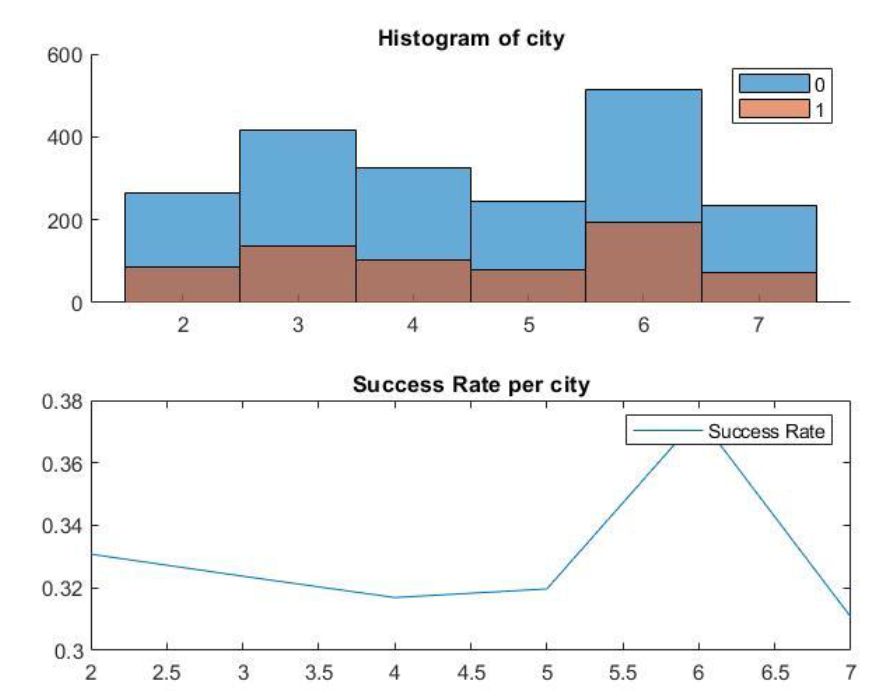
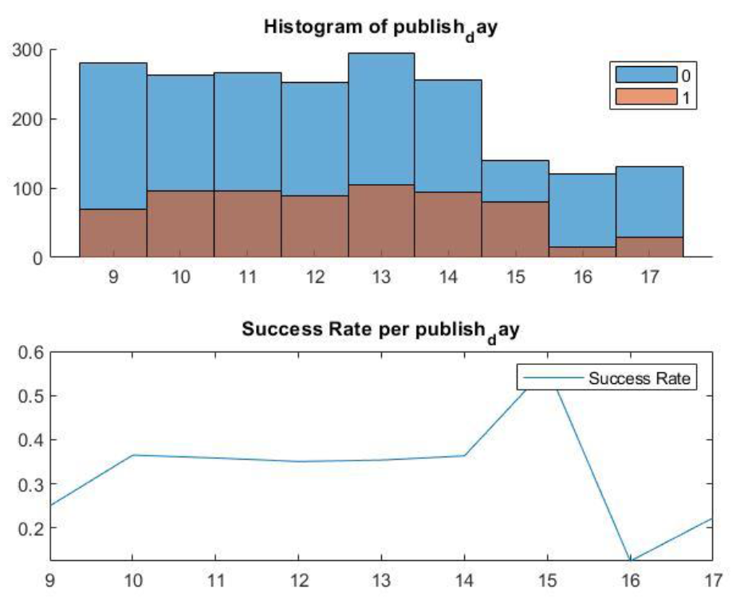
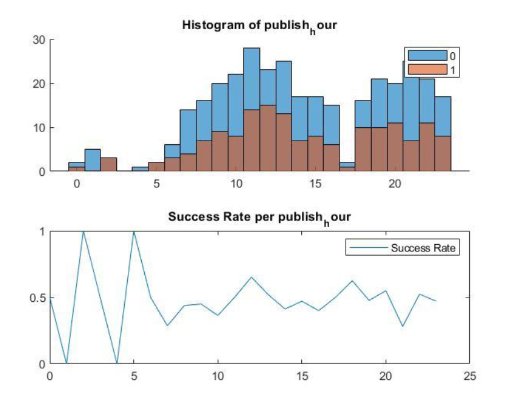
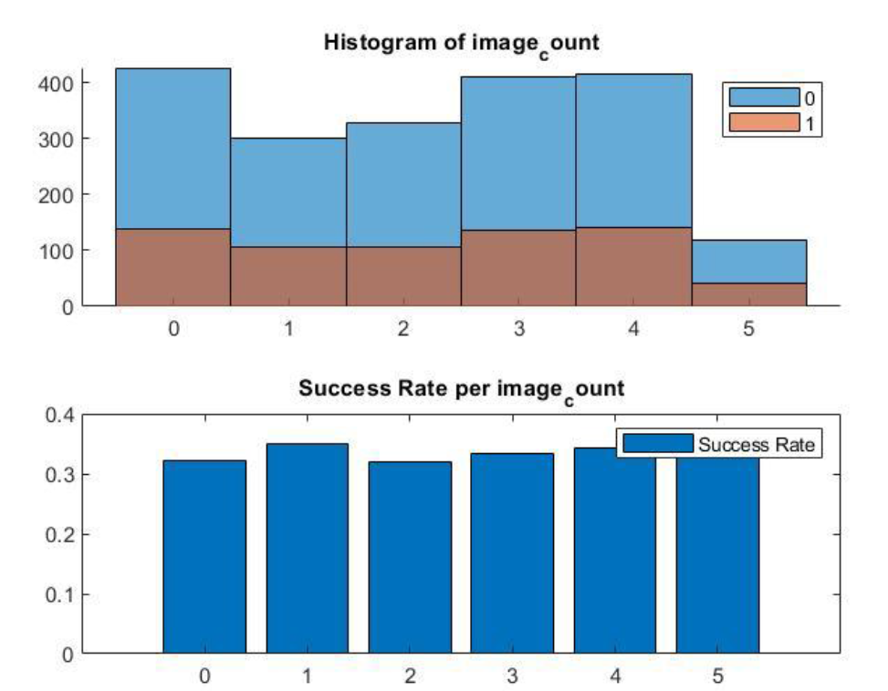

# A successful/unsuccessful clasification over [Divar](https://divar.ir/) Ads using matlab
A fine Gaussian scaled Classification to detect whether an add was successful or not ([Divar](https://divar.ir/))

[Run this file](Make_Data_Great_Again.m)

**For more information checkout comments of the .m files.**

## Data analysis

Actual data from [Divar](https://divar.ir/) was used but in order to respect data privacy policies most of the data is removed and a small part is presented here in order to test this program. Look at [Sample Data](DATA.csv)

### Columns

Using the order in the DATA file we have:
- **Brand:** We convert this column into 3 popular, normal and not popular brand groups (Comparing average view counts)

- **City:** Wer convert this column into 3 big, medium and small city groups (Comparing average view counts)

- **Publish Day:** Between 0 - 31, the day the ad was published in Month

- **Publish Hour:** Between 0-23, the hour the ad was published

- **Archive Day:** Between 0 - 31, the day the ad was archived in Month

- **Publish Hour:** Between 0-23, the hour the ad was archived

- **Image Count:** Integers

- **View Count:** How many times the ad was seen by users

- **Get Contact Count:** How many times users asked for contact information

- **Result:** 1 for successful ads(The item was sold)

**IMPORTANT - The last three columns were created by a watchdog exactly after 5 days for each add so if an ad was archived after 5 days to its creation time it should be considered unarchived.**

